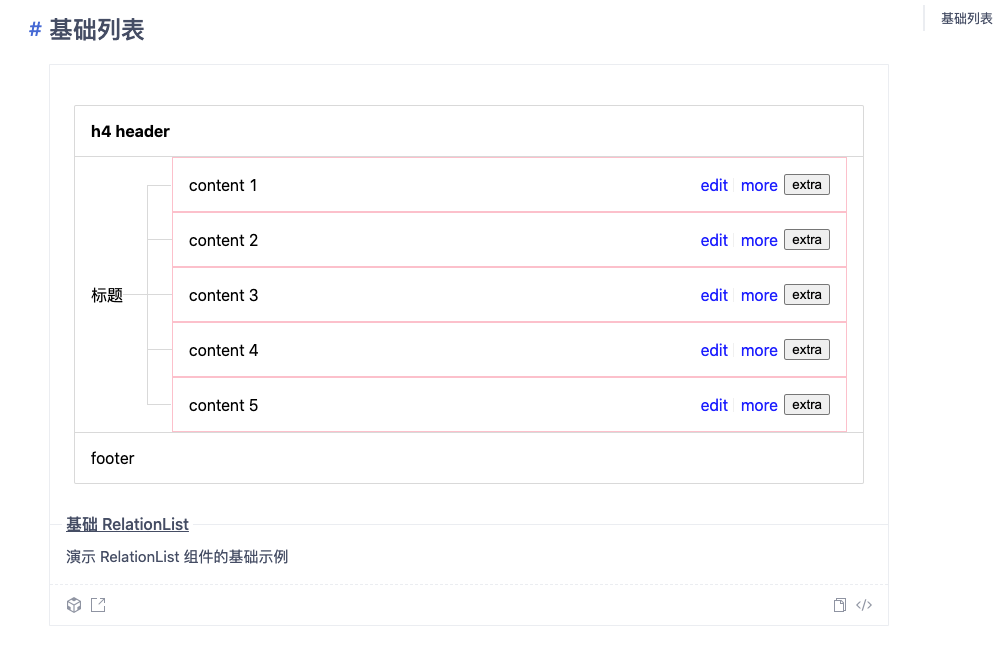
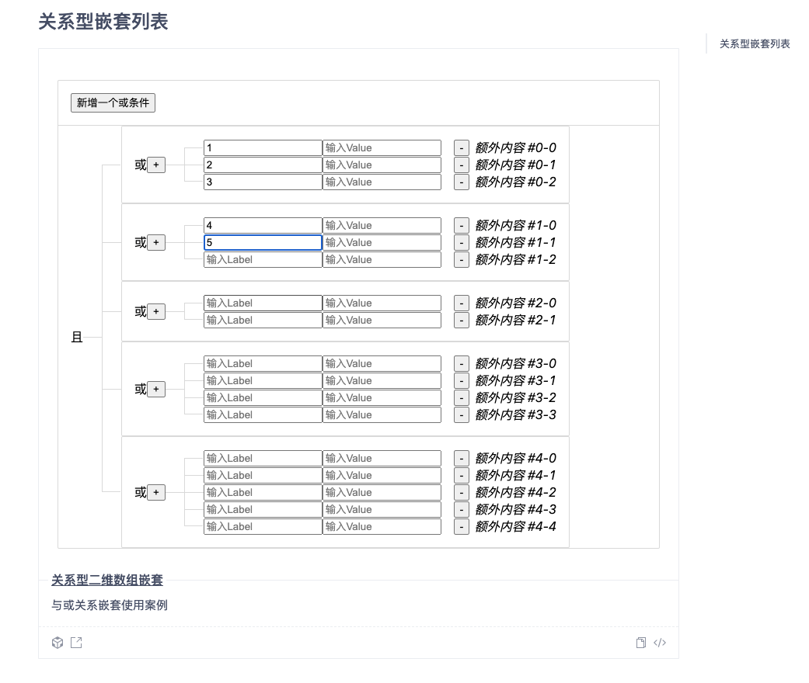

# r-relation-list

Relation List component.

[![NPM version][npm-image]][npm-url] [](https://github.com/umijs/dumi) [![Test coverage][codecov-image]][codecov-url] [![Dependencies][david-image]][david-url] [![DevDependencies][david-dev-image]][david-dev-url] [![npm download][download-image]][download-url] [![bundle size][bundlephobia-image]][bundlephobia-url]

[npm-image]: http://img.shields.io/npm/v/r-relation-list.svg?style=flat-square
[npm-url]: http://npmjs.org/package/r-relation-list
[codecov-image]: https://img.shields.io/codecov/c/github/troublemjs/r-relation-list/master.svg?style=flat-square
[codecov-url]: https://codecov.io/gh/troublemjs/r-relation-list/branch/master
[david-url]: https://david-dm.org/troublemjs/r-relation-list
[david-image]: https://david-dm.org/troublemjs/r-relation-list/status.svg?style=flat-square
[david-dev-url]: https://david-dm.org/troublemjs/r-relation-list?type=dev
[david-dev-image]: https://david-dm.org/troublemjs/r-relation-list/dev-status.svg?style=flat-square
[download-image]: https://img.shields.io/npm/dm/r-relation-list.svg?style=flat-square
[download-url]: https://npmjs.org/package/r-relation-list
[bundlephobia-url]: https://bundlephobia.com/result?p=r-relation-list
[bundlephobia-image]: https://badgen.net/bundlephobia/minzip/r-relation-list

[TOC]

## Screenshots





## Feature

- Support all popular bowsers.

## Example

<a href="http://localhost:8000" target="_blank">localhost example</a>

<a href="https://troublemjs.github.io/r-relation-list/" target="_blank">online example</a>

## Install

[](https://npmjs.org/package/r-relation-list)

## Usage

see examples

## Development

```bash
npm install
npm start
```

## Test Case

/tests/

## Coverage

/coverage/lcov-report/index.html

## License

relation-list is relased under the MIT license.
